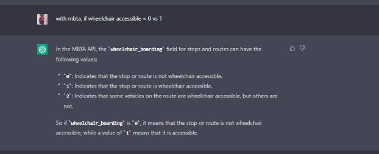

# MBTA_Helper
# Jacob Foti, Bidhi Mandal

1. __Project Overview (~1 paragraph)__

	Our project is a flask-based web application that allows users to input an address and find the nearest MBTA stop along with the arrival time of the next train. We have extended the basic requirements by integrating APIs such as Mapbox and MBTA. That allowed us to achieve functionality. We also incorporated error handling and logging to help identify and fix issues more quickly. We included scoping and testing to ensure that all necessary functionality is included and to catch errors and any dysfunctionality. This project can be further extended by adding more information about those stops, operation hours, etc. 

2. __Reflection (~3 paragraphs + screenshots)__

*a. Discuss the process point of view, including what went well and what could be improved. Provide reflections on topics such as project scoping, testing, and anything else that could have helped the team succeed.*

From the process point of view, we had a good understanding of the project and what we wanted to achieve. We were able to just write down the basic framework of the project, which helped us to come up with a design that was modular and reusable. 
The ‘find_stop_near’ function is the main function as it uses the Mapbox API to get the latitude and the longitude of the input address and then uses the information to find the nearest MBTA station using the MBTA API. We included an MBTA train in the background to help deliver a design that was close to transportation. We also stored the API Keys in a different file incorporating a layer of privacy into the program. In terms of design perspective, we also added a section that will generate a joke. From the improvement point of view, we could add more specific information about the station, like various rails that operate in that specific area. Scoping the project more thoroughly, in the beginning, will help us add more functionality if needed. 

*b. Discuss your team's work division, including how the work was planned to be divided and how it happened. Address any issues that arose while working together and how they were addressed. Finally, discuss what you would do differently next time.*
	
Jacob took on a primary responsibility to help create the modules and I helped to add on to that. We took our time to come up with a design and the extra element for this project together. We also brainstormed the key ideas that we wanted to convey through the reflection as well. We did have a different work division in mind but we each took lead where it was feasible for us and needed for the project. We realized that the major challenge for this project was just being able to collaborate because the process of sharing and syncing the code was somewhat challenging and we would sometimes lose the code in the meantime. To address that issue we used Liveshare on VS Studio Code and hopped on calls to make sure we were in constant communication, discord was also helpful to help us achieve that. We are planning to work on the final project together, so just planning ahead of time will be really helpful. Maybe also keeping you in the loop and communicating if we are stuck will benefit us greatly. 

*c. Discuss from a learning perspective, what you learned through this project and how you'll use what you learned going forward. Reflect on how ChatGPT helped you and what you wish you knew beforehand that could have helped you succeed. Consider including screenshots to demonstrate your project's progress and development.*

We think from the learning perspective being able to build a version of a web app that I often use was super exciting and helpful. Being able to build something sophisticated by breaking them down into sections was a good learning experience and it will definitely influence our thought process in future projects. Chat GPT was very helpful for us to run through some errors and find specific API keys.
We have included screenshots of some cases below. 

